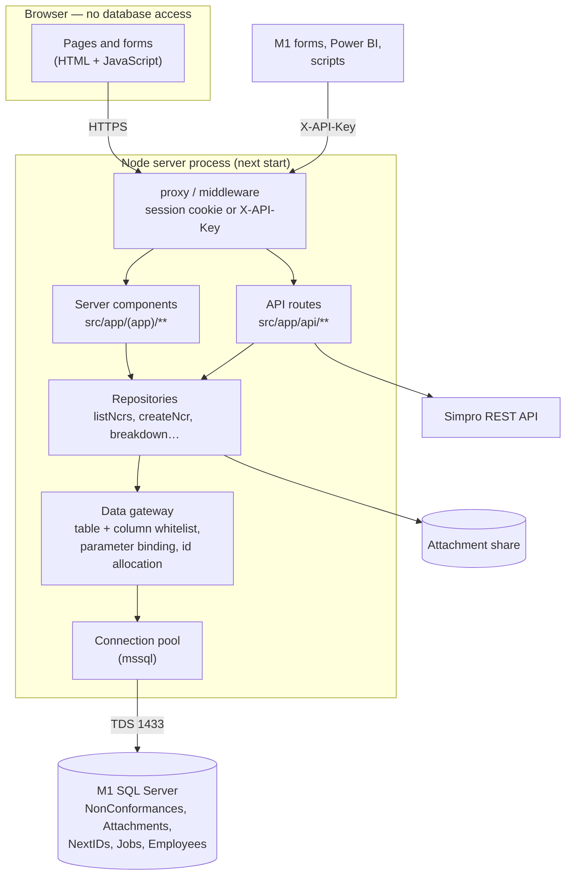
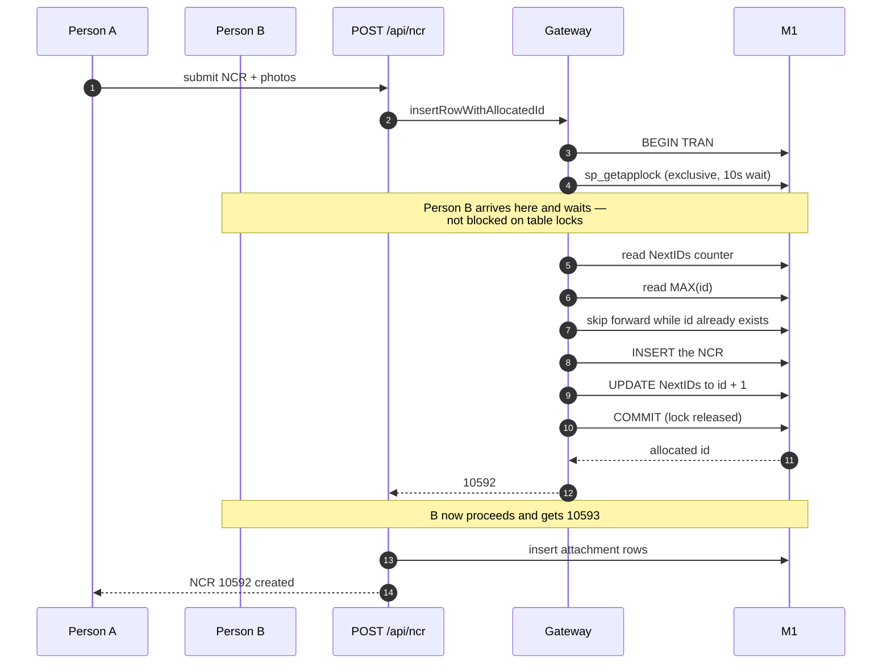

# How the server side works

## The short answer to "does the app touch the database?"

**The browser never touches M1.** It cannot: it has no credentials, no driver,
and no network route to SQL Server. Everything that reads or writes M1 happens
inside the Node process on the server.

There is already an API tier — it just runs in the same process as the pages.

Two things follow from that shape:

- **One door to the database.** Every query in the app goes through
  `src/lib/db/gateway.ts`. It rejects any table or column not declared in
  `tables.ts` and binds every value as a parameter, so a caller cannot compose
  SQL or reach an untracked table. Pages and API routes both go through
  repositories; neither builds a query itself.
- **The API is already the integration point.** `/api/*` is reachable by other
  systems today with an `X-API-Key` header, and documented at `/api-docs`.

## Should the API be a separate service?

It can be, but it is not needed for the reason you gave — the browser already
has no database access.

| | One deployment (today) | Two services |
| --- | --- | --- |
| Browser reaches M1 | No | No |
| DB credentials | One process | One process |
| Deploys | One | Two, kept in step |
| Page render | In-process call | Extra network hop |
| Hosting | One App Service | Two |

A split earns its place when the API needs **different scaling, a different
network zone, or a different release cycle** from the UI. Worth revisiting once
other systems depend on it; it is not a prerequisite for going live.

The same reasoning answers the ports question: 3000 and 4080 would need **two
processes**. One Next.js app serves the pages and `/api` from a single port.
Splitting the port means splitting the service.

## Raising an NCR, end to end

The interesting part is the number: M1 has no `IDENTITY` on
`qarNonConformanceID`, and `dbo.NonConformances` has **no primary key**, so a
duplicate would be accepted silently rather than rejected.

### Why an application lock rather than row locks

The first implementation locked the counter row (`UPDLOCK, HOLDLOCK`) and read
`MAX()` under a range lock. With 12 simultaneous saves, **10 failed with
deadlocks** — the two lock sets acquired in different orders.

`sp_getapplock` is a named mutex: callers queue on the name, not on data pages.
Re-measured with 20 simultaneous allocations: 20 unique ids, no collisions, no
failures, 145 ms in total. Deadlock (1205) and lock-timeout (1222) errors are
retried four times with jittered back-off.

The `WHILE EXISTS` step covers the other case: an id already used by a record
M1's own client inserted without going through `NextIDs`. It advances until it
finds a free number rather than writing a duplicate.

## What each layer is responsible for

| Layer | File(s) | Responsibility |
| --- | --- | --- |
| Gate | `src/middleware.ts` | Session cookie or API key; blocks anonymous traffic |
| Pages | `src/app/(app)/**` | Render; never build queries |
| API | `src/app/api/**` | Validate input (zod), shape responses, HTTP status |
| Repositories | `src/lib/repositories/**` | Domain operations, M1 column names |
| Gateway | `src/lib/db/gateway.ts` | The only SQL. Whitelist, parameters, ids |
| Registry | `src/lib/db/tables.ts` | Which tables and columns exist at all |
| Pool | `src/lib/db/client.ts` | One pooled connection, cached |

Adding a table means one registry entry and one repository. Nothing else can
reach the database.
